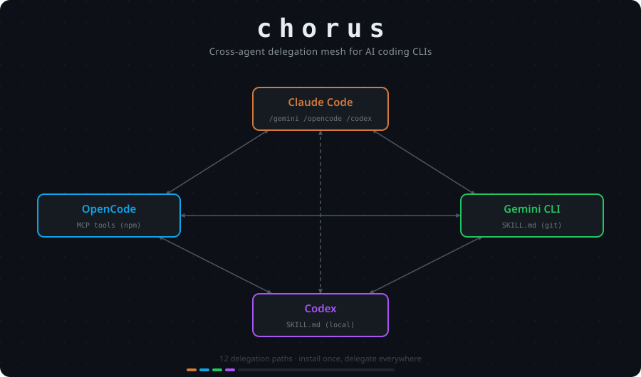

# LLMs Choreographer

Cross-agent plugin collection for AI coding CLIs. Delegate tasks between Claude Code, OpenCode, Gemini CLI, Codex, Cursor, and Kilo.



## Overview

LLMs Choreographer connects six AI coding agents through a full delegation mesh. Every agent can delegate to every other agent (see [Known Limitations](#known-limitations) for OpenCode output capture constraints).

| From \ To | Claude | OpenCode | Gemini | Codex | Cursor | Kilo |
|-----------|--------|----------|--------|-------|--------|------|
| **Claude Code** | self ✅ | ✅ | ✅ | ✅ | ✅ | ✅ |
| **OpenCode** | ✅ | self | ✅ | ✅ | ✅ | ✅ |
| **Gemini CLI** | ✅ | ✅ | self | ✅ | ✅ | ✅ |
| **Codex** | ✅ | ✅ | ✅ | self | ✅ | ✅ |
| **Cursor** | ✅ | ✅ | ✅ | ✅ | self | ✅ |
| **Kilo** | ✅ | ✅ | ✅ | ✅ | ✅ | self |

## Installation

### Claude Code

```bash
claude plugin install https://github.com/valpere/llms-choreographer
```

Adds slash commands:
- `/opencode:run`, `/opencode:review`
- `/gemini:run`, `/gemini:review`
- `/codex:run`, `/codex:review`
- `/claude:setup`, `/claude:run`, `/claude:review` (second Claude instance)
- `/cursor:run`, `/cursor:review`, `/cursor:setup`
- `/kilo:run`, `/kilo:review`, `/kilo:setup`

**Workflow patterns** (orchestrate multiple agents at once):
- `/llms-choreographer:council` — LLM council: five agents, different roles, you synthesize
- `/llms-choreographer:review` — parallel code review from all five agents
- `/llms-choreographer:debug` — parallel root-cause hypotheses for a bug symptom
- `/llms-choreographer:second-opinion` — quick independent check from one agent (`--agent cursor|kilo` supported)
- `/llms-choreographer:vote` — YES / NO / ABSTAIN poll from all five agents, tally returned

### OpenCode

```bash
opencode plugin @valpere/llms-choreographer-opencode
```

Adds MCP tools:
- `delegate_claude(task: string) → string`
- `delegate_gemini(task: string) → string`
- `delegate_codex(task: string) → string`
- `delegate_cursor(task: string) → string`
- `delegate_kilo(task: string) → string`
- `check_agents() → string` — report availability of all five CLIs
- `council(task: string, strict?: boolean) → string` — parallel council, all five agents
- `parallel_review(strict?: boolean) → string` — parallel review of current git diff
- `parallel_debug(symptom: string, strict?: boolean) → string` — parallel root-cause hypotheses
- `second_opinion(approach: string, agent?: 'claude'|'gemini'|'codex'|'cursor'|'kilo') → string` — fallback-enabled single-agent opinion
- `vote(proposition: string) → string` — YES/NO/ABSTAIN tally from all five agents

### Gemini CLI

```bash
# Delegation skills
gemini skills install https://github.com/valpere/llms-choreographer --path for-gemini/claude
gemini skills install https://github.com/valpere/llms-choreographer --path for-gemini/opencode
gemini skills install https://github.com/valpere/llms-choreographer --path for-gemini/codex
gemini skills install https://github.com/valpere/llms-choreographer --path for-gemini/cursor
gemini skills install https://github.com/valpere/llms-choreographer --path for-gemini/kilo

# Workflow pattern skills
gemini skills install https://github.com/valpere/llms-choreographer --path for-gemini/council
gemini skills install https://github.com/valpere/llms-choreographer --path for-gemini/parallel-review
gemini skills install https://github.com/valpere/llms-choreographer --path for-gemini/parallel-debug
gemini skills install https://github.com/valpere/llms-choreographer --path for-gemini/second-opinion
gemini skills install https://github.com/valpere/llms-choreographer --path for-gemini/vote
```

Adds skills:
- `llms-choreographer-claude` - Delegate to Claude Code
- `llms-choreographer-opencode` - Delegate to OpenCode
- `llms-choreographer-codex` - Delegate to Codex
- `llms-choreographer-cursor` - Delegate to Cursor Agent CLI
- `llms-choreographer-kilo` - Delegate to Kilo Code CLI
- `llms-choreographer-council` - LLM council with all five agents
- `llms-choreographer-parallel-review` - Parallel code review
- `llms-choreographer-parallel-debug` - Parallel root-cause hypotheses
- `llms-choreographer-second-opinion` - Quick independent second opinion
- `llms-choreographer-vote` - YES/NO/ABSTAIN parallel vote

### Codex

```bash
git clone https://github.com/valpere/llms-choreographer /tmp/llms-choreographer

# Delegation skills
mkdir -p ~/.codex/skills/llms-choreographer-claude ~/.codex/skills/llms-choreographer-opencode \
         ~/.codex/skills/llms-choreographer-gemini ~/.codex/skills/llms-choreographer-cursor ~/.codex/skills/llms-choreographer-kilo
cp /tmp/llms-choreographer/for-codex/claude/SKILL.md ~/.codex/skills/llms-choreographer-claude/
cp /tmp/llms-choreographer/for-codex/opencode/SKILL.md ~/.codex/skills/llms-choreographer-opencode/
cp /tmp/llms-choreographer/for-codex/gemini/SKILL.md ~/.codex/skills/llms-choreographer-gemini/
cp /tmp/llms-choreographer/for-codex/cursor/SKILL.md ~/.codex/skills/llms-choreographer-cursor/
cp /tmp/llms-choreographer/for-codex/kilo/SKILL.md ~/.codex/skills/llms-choreographer-kilo/

# Workflow pattern skills
mkdir -p ~/.codex/skills/llms-choreographer-council ~/.codex/skills/llms-choreographer-parallel-review \
         ~/.codex/skills/llms-choreographer-parallel-debug ~/.codex/skills/llms-choreographer-second-opinion \
         ~/.codex/skills/llms-choreographer-vote
cp /tmp/llms-choreographer/for-codex/council/SKILL.md ~/.codex/skills/llms-choreographer-council/
cp /tmp/llms-choreographer/for-codex/parallel-review/SKILL.md ~/.codex/skills/llms-choreographer-parallel-review/
cp /tmp/llms-choreographer/for-codex/parallel-debug/SKILL.md ~/.codex/skills/llms-choreographer-parallel-debug/
cp /tmp/llms-choreographer/for-codex/second-opinion/SKILL.md ~/.codex/skills/llms-choreographer-second-opinion/
cp /tmp/llms-choreographer/for-codex/vote/SKILL.md ~/.codex/skills/llms-choreographer-vote/
```

Adds skills:
- `llms-choreographer-claude` - Delegate to Claude Code
- `llms-choreographer-opencode` - Delegate to OpenCode
- `llms-choreographer-gemini` - Delegate to Gemini CLI
- `llms-choreographer-cursor` - Delegate to Cursor Agent CLI
- `llms-choreographer-kilo` - Delegate to Kilo Code CLI
- `llms-choreographer-council` - LLM council with all five agents
- `llms-choreographer-parallel-review` - Parallel code review
- `llms-choreographer-parallel-debug` - Parallel root-cause hypotheses
- `llms-choreographer-second-opinion` - Quick independent second opinion
- `llms-choreographer-vote` - YES/NO/ABSTAIN parallel vote

### Cursor

```bash
git clone https://github.com/valpere/llms-choreographer /tmp/llms-choreographer

mkdir -p .cursor/rules

# Delegation rules
cp /tmp/llms-choreographer/for-cursor/claude/RULE.mdc .cursor/rules/llms-choreographer-claude.mdc
cp /tmp/llms-choreographer/for-cursor/opencode/RULE.mdc .cursor/rules/llms-choreographer-opencode.mdc
cp /tmp/llms-choreographer/for-cursor/gemini/RULE.mdc .cursor/rules/llms-choreographer-gemini.mdc
cp /tmp/llms-choreographer/for-cursor/codex/RULE.mdc .cursor/rules/llms-choreographer-codex.mdc
cp /tmp/llms-choreographer/for-cursor/kilo/RULE.mdc .cursor/rules/llms-choreographer-kilo.mdc

# Workflow pattern rules
cp /tmp/llms-choreographer/for-cursor/council/RULE.mdc .cursor/rules/llms-choreographer-council.mdc
cp /tmp/llms-choreographer/for-cursor/parallel-review/RULE.mdc .cursor/rules/llms-choreographer-parallel-review.mdc
cp /tmp/llms-choreographer/for-cursor/parallel-debug/RULE.mdc .cursor/rules/llms-choreographer-parallel-debug.mdc
cp /tmp/llms-choreographer/for-cursor/second-opinion/RULE.mdc .cursor/rules/llms-choreographer-second-opinion.mdc
cp /tmp/llms-choreographer/for-cursor/vote/RULE.mdc .cursor/rules/llms-choreographer-vote.mdc
```

Adds rules (activate via natural language in Cursor):
- `llms-choreographer-claude` - Delegate to Claude Code
- `llms-choreographer-opencode` - Delegate to OpenCode
- `llms-choreographer-gemini` - Delegate to Gemini CLI
- `llms-choreographer-codex` - Delegate to Codex
- `llms-choreographer-kilo` - Delegate to Kilo Code CLI
- `llms-choreographer-council` - LLM council with all five agents
- `llms-choreographer-parallel-review` - Parallel code review
- `llms-choreographer-parallel-debug` - Parallel root-cause hypotheses
- `llms-choreographer-second-opinion` - Quick independent second opinion
- `llms-choreographer-vote` - YES/NO/ABSTAIN parallel vote

### Kilo

```bash
git clone https://github.com/valpere/llms-choreographer /tmp/llms-choreographer

# Delegation skills
mkdir -p ~/.kilo/skills/llms-choreographer-claude ~/.kilo/skills/llms-choreographer-opencode \
         ~/.kilo/skills/llms-choreographer-gemini ~/.kilo/skills/llms-choreographer-codex ~/.kilo/skills/llms-choreographer-cursor
cp /tmp/llms-choreographer/for-kilo/claude/SKILL.md ~/.kilo/skills/llms-choreographer-claude/
cp /tmp/llms-choreographer/for-kilo/opencode/SKILL.md ~/.kilo/skills/llms-choreographer-opencode/
cp /tmp/llms-choreographer/for-kilo/gemini/SKILL.md ~/.kilo/skills/llms-choreographer-gemini/
cp /tmp/llms-choreographer/for-kilo/codex/SKILL.md ~/.kilo/skills/llms-choreographer-codex/
cp /tmp/llms-choreographer/for-kilo/cursor/SKILL.md ~/.kilo/skills/llms-choreographer-cursor/

# Workflow pattern skills
mkdir -p ~/.kilo/skills/llms-choreographer-council ~/.kilo/skills/llms-choreographer-parallel-review \
         ~/.kilo/skills/llms-choreographer-parallel-debug ~/.kilo/skills/llms-choreographer-second-opinion \
         ~/.kilo/skills/llms-choreographer-vote
cp /tmp/llms-choreographer/for-kilo/council/SKILL.md ~/.kilo/skills/llms-choreographer-council/
cp /tmp/llms-choreographer/for-kilo/parallel-review/SKILL.md ~/.kilo/skills/llms-choreographer-parallel-review/
cp /tmp/llms-choreographer/for-kilo/parallel-debug/SKILL.md ~/.kilo/skills/llms-choreographer-parallel-debug/
cp /tmp/llms-choreographer/for-kilo/second-opinion/SKILL.md ~/.kilo/skills/llms-choreographer-second-opinion/
cp /tmp/llms-choreographer/for-kilo/vote/SKILL.md ~/.kilo/skills/llms-choreographer-vote/
```

Adds skills:
- `llms-choreographer-claude` - Delegate to Claude Code
- `llms-choreographer-opencode` - Delegate to OpenCode
- `llms-choreographer-gemini` - Delegate to Gemini CLI
- `llms-choreographer-codex` - Delegate to Codex
- `llms-choreographer-cursor` - Delegate to Cursor Agent CLI
- `llms-choreographer-council` - LLM council with all five agents
- `llms-choreographer-parallel-review` - Parallel code review
- `llms-choreographer-parallel-debug` - Parallel root-cause hypotheses
- `llms-choreographer-second-opinion` - Quick independent second opinion
- `llms-choreographer-vote` - YES/NO/ABSTAIN parallel vote

## Usage Examples

### Claude Code

```bash
# Run a task in the foreground
/opencode:run --wait "What's the purpose of this codebase?"

# Run a task in the background
/gemini:run --background "Summarize the architecture in 3 sentences."

# Get code reviews from all agents
/codex:review --wait
/opencode:review --wait
/gemini:review --wait
/claude:review --wait

# Get a security-focused review
/claude:run --wait "List potential security issues in this code."
```

### OpenCode

Once the plugin is installed, OpenCode will automatically discover the MCP tools. Use natural language:

```
"Ask Claude to review this function for edge cases"
"Get Gemini's opinion on this architecture"
"Delegate this refactoring task to Codex"
```

### Gemini CLI

Once skills are installed, Gemini will activate them based on context:

```bash
gemini --prompt "Get a second opinion from Claude on my current approach"
```

### Codex

Once skills are installed, Codex will activate them when you mention delegating:

```bash
codex "Ask Gemini to analyze this file for performance issues"
```

### Cursor

Once rules are installed in `.cursor/rules/`, Cursor will activate them based on context:

```bash
# In a Cursor Agent session:
"Get a second opinion from Claude on this approach"
"Run a parallel review with all agents"
"Ask Kilo if this naming is clear enough"
```

### Kilo

Once skills are installed, Kilo will activate them when you mention delegating:

```bash
kilo run --auto "Ask Gemini to review this for edge cases"
kilo run --auto "Run a council on whether to use Redis or Postgres for this queue"
```

## Workflow Patterns

LLMs Choreographer ships five workflow pattern commands. The multi-agent workflows (`/llms-choreographer:council`, `/llms-choreographer:review`, `/llms-choreographer:debug`, `/llms-choreographer:vote`) orchestrate **multiple agents in parallel**; `/llms-choreographer:second-opinion` runs with a single agent and falls back automatically if the requested agent is unavailable. Install the `llms-choreographer` plugin once to access all five.

**Graceful degradation:** All workflows check agent availability at runtime. Missing agents are reported in the output with install instructions. For `council`, `review`, and `debug`, the command proceeds with the available subset — a minimum of 2 agents is required. `/llms-choreographer:second-opinion` requires only 1 available agent.

### LLM Council

Five agents tackle the same task with different roles; the host synthesizes as chairman.

```bash
/llms-choreographer:council "Should we use optimistic locking or a distributed lock for this feature?"
/llms-choreographer:council --background "Review the architecture of the new auth service"
```

### Parallel Review

All five agents review the current `git diff HEAD` simultaneously, each with a different focus (correctness, edge cases, scope, integration, maintainability).

```bash
/llms-choreographer:review --wait
/llms-choreographer:review --background
```

### Parallel Debug

All five agents propose root-cause hypotheses for a symptom; the host synthesizes an investigation plan.

```bash
/llms-choreographer:debug "Checkout fails intermittently with a 500 — only in production, never in staging"
```

### Second Opinion

Quick independent check from one agent. Default: Gemini. Override with `--agent`.

```bash
/llms-choreographer:second-opinion "Use a ULID instead of UUID for the new events table primary key"
/llms-choreographer:second-opinion --agent claude "Cache the auth token in localStorage vs sessionStorage"
/llms-choreographer:second-opinion --agent codex "Extract this 30-line block into a shared utility"
/llms-choreographer:second-opinion --agent cursor "Does this change fit the existing patterns in this repo?"
/llms-choreographer:second-opinion --agent kilo "Is this function name clear enough for future maintainers?"
```

### Parallel Vote

YES / NO / ABSTAIN poll from all five agents. Use when you want a decision signal rather than discussion.

```bash
/llms-choreographer:vote "Adopt TypeScript for new files in this repo?"
/llms-choreographer:vote "Add Redis as a dependency for session caching?"
/llms-choreographer:vote --json "Use optimistic locking for this resource?"
```

The output is a tally table plus one-sentence rationale per agent. Use `/llms-choreographer:council` when you want reasoning and trade-offs; use `/llms-choreographer:vote` when you want a thumbs-up/thumbs-down count.

### Using llms-choreographer in Claude Code Plan mode

Claude Code's Plan mode is a good entry point for llms-choreographer workflows. When you enter Plan mode before a complex feature, call `/llms-choreographer:council` to get multi-agent input before committing to an approach, or `/llms-choreographer:second-opinion` for a quick sanity check on a specific decision.

```bash
# During architecture planning — get five perspectives before writing code
/llms-choreographer:council "We need to add distributed rate limiting. Redis vs in-memory vs a dedicated proxy?"

# Quick check on a specific design choice
/llms-choreographer:second-opinion --agent codex "Is a factory function better than a class here?"
```

The council output feeds directly into your plan: consensus points become confirmed requirements, disagreements surface trade-offs worth deciding before implementation starts. Use `/llms-choreographer:vote` for quick yes/no decisions ("should we add Redis?", "adopt TypeScript?") where a tally is more useful than a discussion.

---

## Execution Modes

All `run` and `review` commands support two execution modes:

- `--wait` (or no flag with user confirmation) - Run in foreground and return results immediately
- `--background` - Run as a background task and notify when complete

The five llms-choreographer workflow commands (`council`, `review`, `debug`, `second-opinion`, `vote`) also support:

- `--json` - Emit structured JSON on stdout instead of delimited text. Warnings about unavailable agents still go to stderr. Useful for scripting or programmatic consumption of agent output.
  - `council` / `review` / `debug` / `second-opinion`: `{"command":"<cmd>","results":[{"name":"...","output":"...","error":"...","exitCode":0}]}`
  - `vote`: `{"command":"vote","tally":{"yes":N,"no":N,"abstain":N,"invalid":N},"results":[{"name":"...","vote":"YES|NO|ABSTAIN|INVALID","rationale":"...","output":"...","error":"...","exitCode":0}]}`

## Requirements

- Node.js >= 18.18.0
- [Claude Code](https://docs.anthropic.com/en/docs/agents-and-tools/claude-code/overview) (for delegation from OpenCode/Gemini/Codex)
- [OpenCode](https://opencode.ai) (for delegation to/from OpenCode)
- [Gemini CLI](https://github.com/google-gemini/gemini-cli) (for delegation to/from Gemini)
- [Codex](https://github.com/openai/codex) (for delegation to/from Codex)
- [Cursor Agent CLI](https://cursor.com/docs/cli) (`agent` binary, optional — for Cursor delegation)
- [Kilo Code CLI](https://kilo.ai/docs/cli) (`kilo` binary, optional — for Kilo delegation)

Not all agents need to be installed. `/llms-choreographer:second-opinion` works with at least 1 available agent; the other multi-agent workflows (`council`, `review`, `debug`) require at least 2.

## Project Structure

```
llms-choreographer/
├── .claude-plugin/
│   └── marketplace.json       # Claude Code plugin marketplace
├── plugins/                   # Claude Code plugins
│   ├── claude/                # Claude Code self-delegation
│   ├── opencode/              # OpenCode plugin
│   ├── gemini/                # Gemini CLI plugin
│   ├── codex/                 # Codex plugin
│   ├── cursor/                # Cursor Agent CLI plugin
│   ├── kilo/                  # Kilo Code CLI plugin
│   └── llms-choreographer/                # Workflow patterns (council, review, debug, second-opinion, vote)
├── for-gemini/                # Gemini CLI skills
│   ├── claude/SKILL.md
│   ├── opencode/SKILL.md
│   ├── codex/SKILL.md
│   ├── cursor/SKILL.md
│   ├── kilo/SKILL.md
│   ├── council/SKILL.md
│   ├── parallel-review/SKILL.md
│   ├── parallel-debug/SKILL.md
│   ├── second-opinion/SKILL.md
│   └── vote/SKILL.md
├── for-codex/                 # Codex skills
│   ├── claude/SKILL.md
│   ├── opencode/SKILL.md
│   ├── gemini/SKILL.md
│   ├── cursor/SKILL.md
│   ├── kilo/SKILL.md
│   ├── council/SKILL.md
│   ├── parallel-review/SKILL.md
│   ├── parallel-debug/SKILL.md
│   ├── second-opinion/SKILL.md
│   └── vote/SKILL.md
├── for-cursor/                # Cursor Agent CLI rules
│   ├── claude/RULE.mdc
│   ├── opencode/RULE.mdc
│   ├── gemini/RULE.mdc
│   ├── codex/RULE.mdc
│   ├── kilo/RULE.mdc
│   ├── council/RULE.mdc
│   ├── parallel-review/RULE.mdc
│   ├── parallel-debug/RULE.mdc
│   ├── second-opinion/RULE.mdc
│   └── vote/RULE.mdc
├── for-kilo/                  # Kilo Code CLI skills
│   ├── claude/SKILL.md
│   ├── opencode/SKILL.md
│   ├── gemini/SKILL.md
│   ├── codex/SKILL.md
│   ├── cursor/SKILL.md
│   ├── council/SKILL.md
│   ├── parallel-review/SKILL.md
│   ├── parallel-debug/SKILL.md
│   ├── second-opinion/SKILL.md
│   └── vote/SKILL.md
├── for-opencode/              # OpenCode MCP package
│   ├── package.json
│   └── src/
│       └── index.js
├── package.json
└── README.md
```

## Known Limitations

### Codex sandbox restricts file access

Codex runs inside a bubblewrap sandbox that limits filesystem access to the
current working directory. When you delegate a task to Codex from another agent,
Codex can only read files **within the directory where it was launched** — not
arbitrary paths on the system.

**Practical impact:** If you invoke `/codex:run` or `llms-choreographer-codex` from a
project outside Codex's working directory (e.g. running Claude Code in
`~/wrk/projectA` but Codex is launched in `~/wrk/common`), Codex will produce
metadata-only output (file sizes, directory structure) instead of content-based
analysis.

**Workaround:** Run Codex from the same project root as the other agents, or
use `codex --no-sandbox` if your environment supports it.

### OpenCode stdout is not capturable

`opencode run` is a TUI application — it writes ANSI output to the terminal but
does not expose stdout for programmatic capture. LLMs Choreographer uses `claude --print` as
a proxy when a third council voice is needed from within Claude Code.

**Practical impact:** The `delegate_claude` MCP tool in the OpenCode plugin
works correctly. The reverse path (using OpenCode as a council member from
Claude Code) requires the TUI to be visible.

---

## License

MIT
