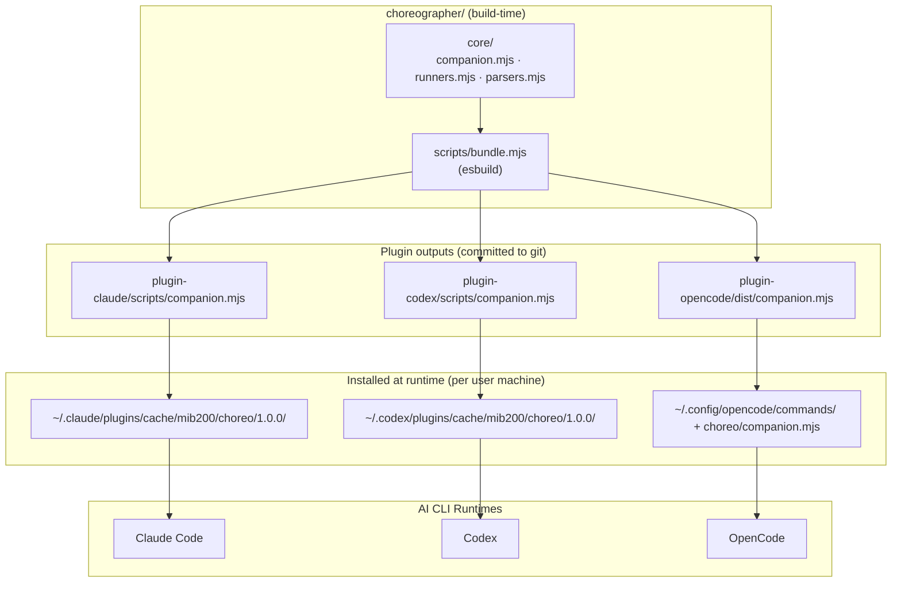
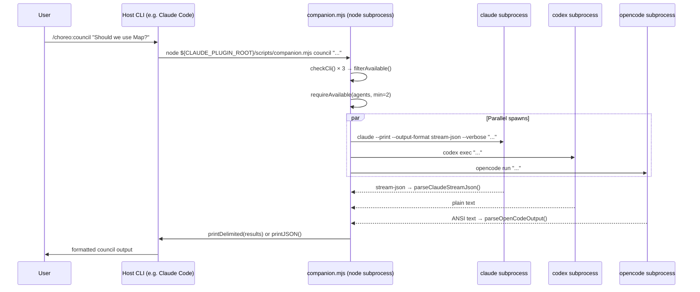
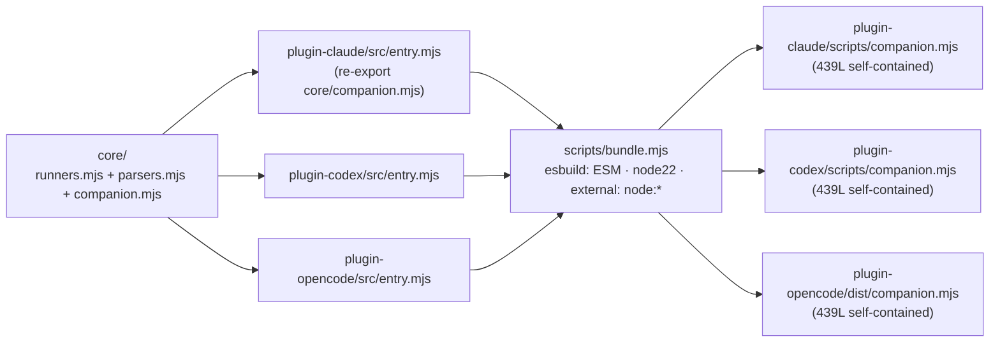
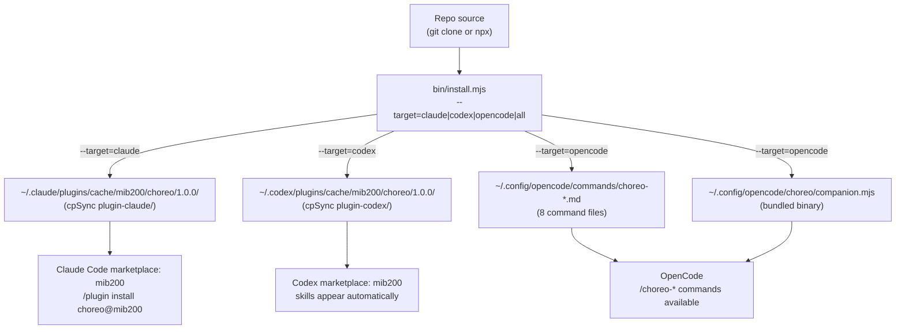
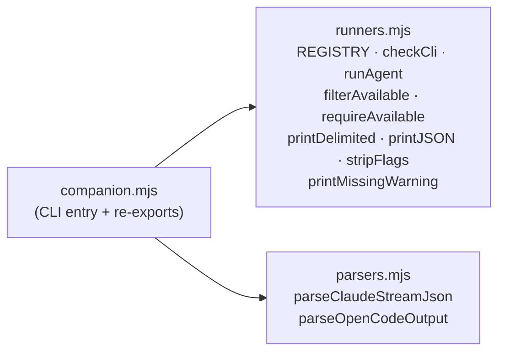

# System Architecture — Choreographer

> See also: [Codebase Summary](./codebase-summary.md) · [Project Overview / PDR](./project-overview-pdr.md) · [Deployment Guide](./deployment-guide.md) · [Delegation Reference](./delegation.md)

## Overview

Choreographer is a build-time monorepo whose runtime artifact is a single self-contained `companion.mjs` file bundled into each plugin. The architecture is ACP-first: a broker daemon manages Agent Client Protocol connections to all agents (Claude, Codex, OpenCode), with native subprocess fallbacks. Multi-agent capabilities include council deliberation (6-phase state machine), adversarial review, and a verifier loop for iterative quality gates.

---

## Component Diagram



---

## Data Flow — Council Command



---

## Plugin Bundle Flow



Each `entry.mjs` is a one-line re-export. esbuild tree-shakes and inlines all `core/` source. The output is a single ESM file with no npm dependencies — only Node.js builtins (`node:child_process`, `node:fs`, `node:url`, `node:os`, `node:path`).

---

## Install Flow



---

## Core Module Relationships



`companion.mjs` imports from both modules and re-exports everything — plugins import only `companion.mjs`.

---

## REGISTRY

```js
export const REGISTRY = {
  claude:   { binary: 'claude',   setup: '/choreo:claude'   },
  codex:    { binary: 'codex',    setup: '/choreo:codex'    },
  opencode: { binary: 'opencode', setup: '/choreo:opencode' },
};
```

Each entry maps a logical agent name to:
- `binary` — the executable name used in `spawnSync` / `spawn`
- `setup` — the slash command shown in install hint messages

---

## Command Namespace Summary

| Runtime | Namespace | Example |
|---------|-----------|---------|
| Claude Code | `/choreo:*` | `/choreo:council` |
| Codex | skill name (no slash prefix) | `choreo-council` skill |
| OpenCode | `/choreo-*` | `/choreo-council` |

The difference in separator (colon vs hyphen) is a constraint of each runtime's command file naming convention.

---

## Key Design Constraints

| Constraint | Reason |
|------------|--------|
| `${CLAUDE_PLUGIN_ROOT}` with curly braces | Claude Code template substitution requires `${}` not `$()` or bare `$VAR` |
| `--output-format stream-json --verbose` for Claude | Bedrock returns empty `result` with plain `--print`; stream-json is the only reliable output format |
| No runtime npm deps | Bundled outputs must be self-contained for plugin environments without a `node_modules` |
| `--dangerously-skip-permissions` on delegated Claude calls | Delegated Claude instance is sandboxed under host agent supervision; non-interactive mode requires it |
| Bundled outputs committed to git | Plugins are installed by file copy, not npm install; the bundle must be present in the repo |
