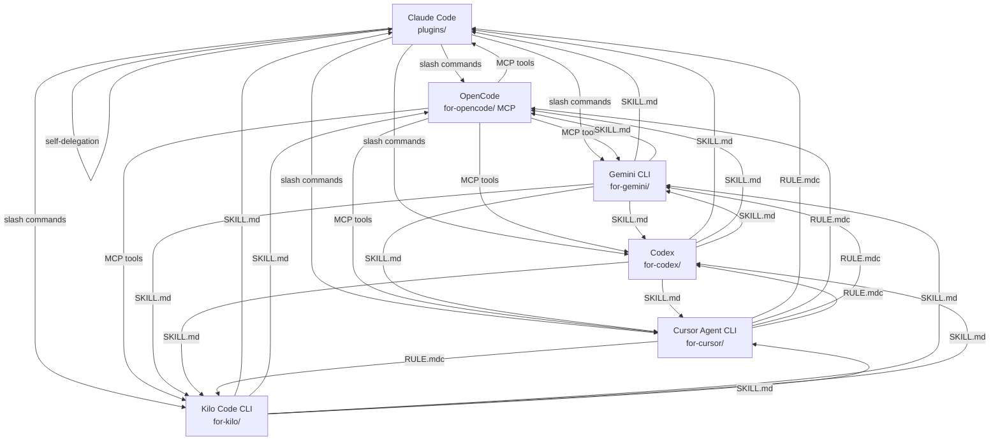
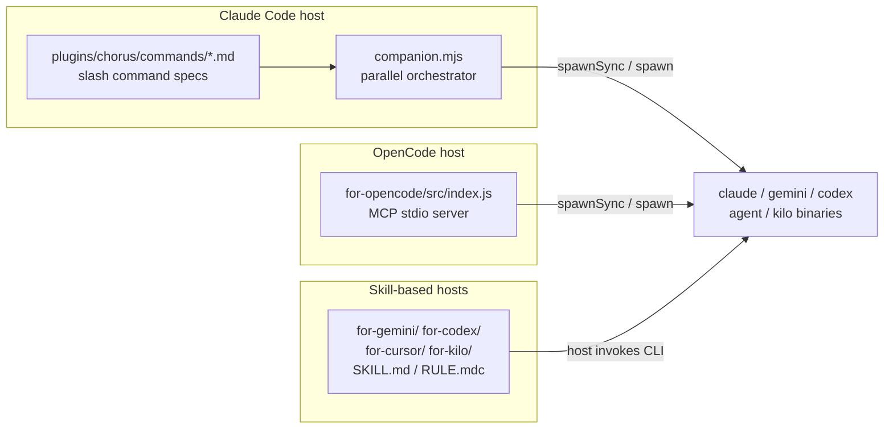
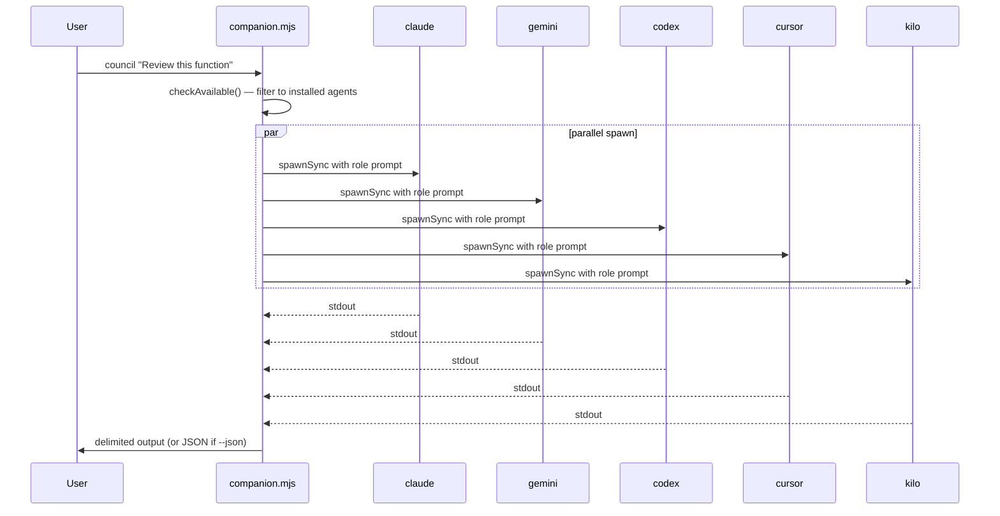
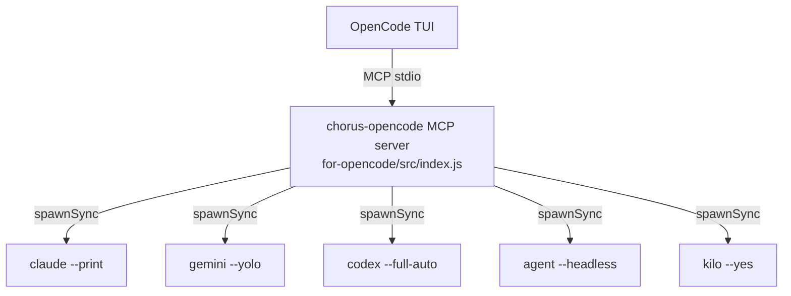

# System Architecture — Chorus

## Overview

Chorus is a thin integration layer — no central server, no shared state. Each host agent gets its own native plugin format that drives non-interactive CLI invocations of the target agents.

---

## Delegation Mesh

Every agent can delegate to every other agent. OpenCode participates as a delegation *target* only (its TUI stdout cannot be captured for outbound delegation).



---

## Component Architecture



---

## Plugin Formats by Host

| Host | Format | Location | Discovery |
|------|--------|----------|-----------|
| Claude Code | `.claude-plugin/plugin.json` + `commands/*.md` | `plugins/<agent>/` | Plugin marketplace / manual install |
| OpenCode | MCP stdio server | `for-opencode/` (npm package `@valpere/chorus-opencode`) | `opencode.json` MCP config |
| Gemini CLI | `SKILL.md` | `for-gemini/<target>/` | Copied to `~/.gemini/skills/` |
| Codex | `SKILL.md` | `for-codex/<target>/` | Copied to `~/.codex/skills/` |
| Cursor Agent CLI | `RULE.mdc` | `for-cursor/<target>/` | Copied to `.cursor/rules/` |
| Kilo Code CLI | `SKILL.md` | `for-kilo/<target>/` | Copied to `.kilo/skills/` |

---

## companion.mjs — Parallel Orchestrator

`plugins/chorus/scripts/companion.mjs` is the core execution engine for Claude Code's workflow patterns.

### CLI Subcommands

| Subcommand | Min agents | Description |
|---|---|---|
| `check-all` | — | Check availability of all 5 target CLIs |
| `council <task>` | 2 | Each agent tackles the task from an assigned perspective |
| `review [task]` | 2 | Parallel code review of current git diff |
| `debug <task>` | 2 | Parallel root-cause hypotheses |
| `second-opinion <approach>` | 1 | One independent agent evaluates an approach |
| `vote <proposition>` | 2 | Each agent votes YES/NO/ABSTAIN with rationale |

### Flags

| Flag | Applies to | Effect |
|---|---|---|
| `--json` | `council`, `review`, `debug`, `second-opinion`, `vote` | Emit structured JSON instead of delimited text |
| `--min-agents N` | `council`, `review`, `debug`, `vote` | Require at least N available agents |

### Agent Role Assignment (council/review/debug)

```
claude   → correctness, type safety, logic errors
gemini   → edge cases, infrastructure, concurrency
codex    → scope simplicity, off-by-one, input handling
cursor   → integration, framework/library issues
kilo     → naming, readability, maintainability
```

### Data Flow



---

## MCP Server (for-opencode/src/index.js)

The OpenCode MCP server exposes 11 tools over stdio transport.

### Tool Catalog

| Tool | Description |
|------|-------------|
| `delegate_claude` | Delegate task to Claude Code, return output |
| `delegate_gemini` | Delegate task to Gemini CLI, return output |
| `delegate_codex` | Delegate task to Codex, return output |
| `delegate_cursor` | Delegate task to Cursor Agent CLI, return output |
| `delegate_kilo` | Delegate task to Kilo Code CLI, return output |
| `check_agents` | Report availability of all 5 target CLIs |
| `council` | LLM council: 5 agents with assigned roles in parallel |
| `parallel_review` | Parallel git-diff code review across 5 agents |
| `parallel_debug` | Parallel root-cause hypotheses across 5 agents |
| `second_opinion` | One independent agent evaluates an approach (with fallback) |
| `vote` | YES/NO/ABSTAIN parallel vote with tally |

### Service Dependency Graph



### second_opinion Fallback Behavior

`second_opinion` selects an agent using a priority list. If the requested agent is unavailable, it falls back to the next available agent in `defaultOrder`. This ensures the tool always returns a result when at least one agent is installed.

---

## Known Limitations

| Limitation | Impact | Workaround |
|---|---|---|
| OpenCode TUI stdout not capturable | OpenCode cannot participate in outbound parallel workflows | OpenCode is delegation-target only; use Claude Code as host for parallel workflows |
| Codex sandbox file access restrictions | Codex may not read arbitrary paths inside its sandbox | Pass file contents inline in the task prompt |
| Parallel workflows use `spawnSync` | Long-running tasks block the Node.js event loop | Intended for short code-review/analysis tasks; not for multi-minute agent runs |

---

## See Also

- [Project Overview & PDR](project-overview-pdr.md) — design decisions
- [Code Standards](code-standards.md) — conventions for extending the mesh
- [Testing Guide](testing-guide.md) — how companion.mjs and MCP server are tested
